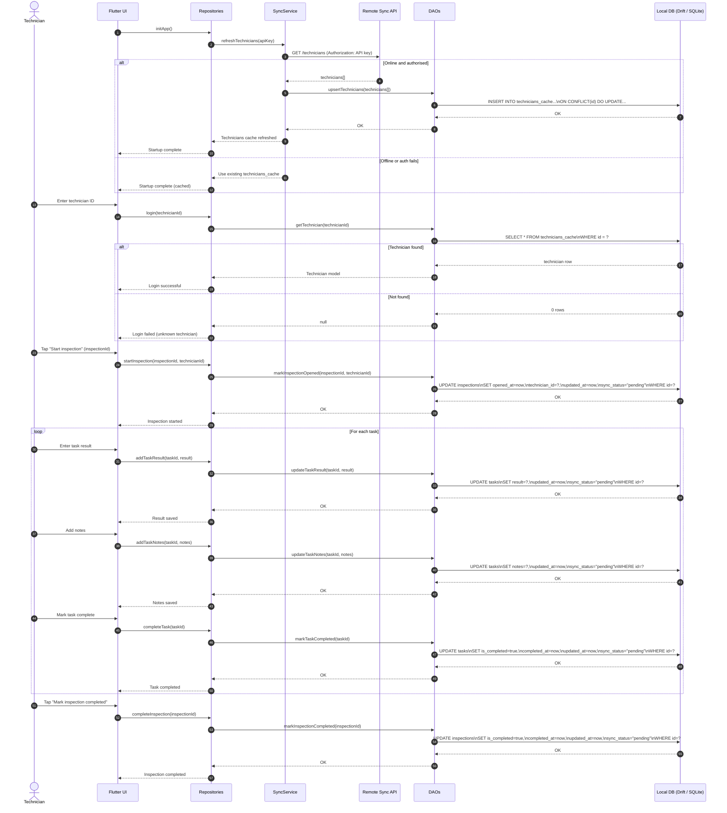

```mermaid
sequenceDiagram
  autonumber

  actor Tech as Technician
  participant UI as Flutter UI
  participant Repos as Repositories
  participant Sync as SyncService
  participant API as Remote Sync API
  participant DAOs as DAOs
  participant LDB as Local DB (Drift / SQLite)

  %% App startup: refresh technicians cache (new API sync)
  UI->>Repos: initApp()
  Repos->>Sync: refreshTechnicians(apiKey)

  Sync->>API: GET /technicians (Authorization: API key)
  alt Online and authorised
    API-->>Sync: technicians[]
    Sync->>DAOs: upsertTechnicians(technicians[])
    DAOs->>LDB: INSERT INTO technicians_cache...\nON CONFLICT(id) DO UPDATE...
    LDB-->>DAOs: OK
    DAOs-->>Sync: OK
    Sync-->>Repos: Technicians cache refreshed
    Repos-->>UI: Startup complete
  else Offline or auth fails
    Sync-->>Repos: Use existing technicians_cache
    Repos-->>UI: Startup complete (cached)
  end

  %% Login (uses local technicians_cache)
  Tech->>UI: Enter technician ID
  UI->>Repos: login(technicianId)
  Repos->>DAOs: getTechnician(technicianId)
  DAOs->>LDB: SELECT * FROM technicians_cache\nWHERE id = ?
  alt Technician found
    LDB-->>DAOs: technician row
    DAOs-->>Repos: Technician model
    Repos-->>UI: Login successful
  else Not found
    LDB-->>DAOs: 0 rows
    DAOs-->>Repos: null
    Repos-->>UI: Login failed (unknown technician)
  end

  %% Start inspection
  Tech->>UI: Tap "Start inspection" (inspectionId)
  UI->>Repos: startInspection(inspectionId, technicianId)
  Repos->>DAOs: markInspectionOpened(inspectionId, technicianId)
  DAOs->>LDB: UPDATE inspections\nSET opened_at=now,\ntechnician_id=?,\nupdated_at=now,\nsync_status="pending"\nWHERE id=?
  LDB-->>DAOs: OK
  DAOs-->>Repos: OK
  Repos-->>UI: Inspection started

  %% Complete tasks
  loop For each task
    %% Add task result
    Tech->>UI: Enter task result
    UI->>Repos: addTaskResult(taskId, result)
    Repos->>DAOs: updateTaskResult(taskId, result)
    DAOs->>LDB: UPDATE tasks\nSET result=?,\nupdated_at=now,\nsync_status="pending"\nWHERE id=?
    LDB-->>DAOs: OK
    DAOs-->>Repos: OK
    Repos-->>UI: Result saved

    %% Add task notes
    Tech->>UI: Add notes
    UI->>Repos: addTaskNotes(taskId, notes)
    Repos->>DAOs: updateTaskNotes(taskId, notes)
    DAOs->>LDB: UPDATE tasks\nSET notes=?,\nupdated_at=now,\nsync_status="pending"\nWHERE id=?
    LDB-->>DAOs: OK
    DAOs-->>Repos: OK
    Repos-->>UI: Notes saved

    %% Mark task complete
    Tech->>UI: Mark task complete
    UI->>Repos: completeTask(taskId)
    Repos->>DAOs: markTaskCompleted(taskId)
    DAOs->>LDB: UPDATE tasks\nSET is_completed=true,\ncompleted_at=now,\nupdated_at=now,\nsync_status="pending"\nWHERE id=?
    LDB-->>DAOs: OK
    DAOs-->>Repos: OK
    Repos-->>UI: Task completed
  end

  %% Finish inspection
  Tech->>UI: Tap "Mark inspection completed"
  UI->>Repos: completeInspection(inspectionId)
  Repos->>DAOs: markInspectionCompleted(inspectionId)
  DAOs->>LDB: UPDATE inspections\nSET is_completed=true,\ncompleted_at=now,\nupdated_at=now,\nsync_status="pending"\nWHERE id=?
  LDB-->>DAOs: OK
  DAOs-->>Repos: OK
  Repos-->>UI: Inspection completed
```
