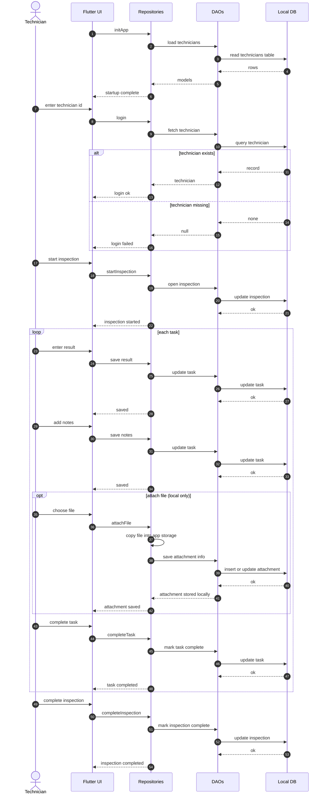

```mermaid
sequenceDiagram
  autonumber

  actor Tech as Technician
  participant UI as Flutter UI
  participant Repos as Repositories
  participant DAOs as DAOs
  participant LDB as Local DB

  UI->>Repos: initApp
  Repos->>DAOs: load technicians
  DAOs->>LDB: read technicians table
  LDB-->>DAOs: rows
  DAOs-->>Repos: models
  Repos-->>UI: startup complete

  Tech->>UI: enter technician id
  UI->>Repos: login
  Repos->>DAOs: fetch technician
  DAOs->>LDB: query technician
  alt technician exists
    LDB-->>DAOs: record
    DAOs-->>Repos: technician
    Repos-->>UI: login ok
  else technician missing
    LDB-->>DAOs: none
    DAOs-->>Repos: null
    Repos-->>UI: login failed
  end

  Tech->>UI: start inspection
  UI->>Repos: startInspection
  Repos->>DAOs: open inspection
  DAOs->>LDB: update inspection
  LDB-->>DAOs: ok
  Repos-->>UI: inspection started

  loop each task
    Tech->>UI: enter result
    UI->>Repos: save result
    Repos->>DAOs: update task
    DAOs->>LDB: update task
    LDB-->>DAOs: ok
    Repos-->>UI: saved

    Tech->>UI: add notes
    UI->>Repos: save notes
    Repos->>DAOs: update task
    DAOs->>LDB: update task
    LDB-->>DAOs: ok
    Repos-->>UI: saved

    opt attach file (local only)
      Tech->>UI: choose file
      UI->>Repos: attachFile
      Repos->>Repos: copy file into app storage
      Repos->>DAOs: save attachment info
      DAOs->>LDB: insert or update attachment
      LDB-->>DAOs: ok
      DAOs-->>Repos: attachment stored locally
      Repos-->>UI: attachment saved
    end

    Tech->>UI: complete task
    UI->>Repos: completeTask
    Repos->>DAOs: mark task complete
    DAOs->>LDB: update task
    LDB-->>DAOs: ok
    Repos-->>UI: task completed
  end

  Tech->>UI: complete inspection
  UI->>Repos: completeInspection
  Repos->>DAOs: mark inspection complete
  DAOs->>LDB: update inspection
  LDB-->>DAOs: ok
  Repos-->>UI: inspection completed

```
