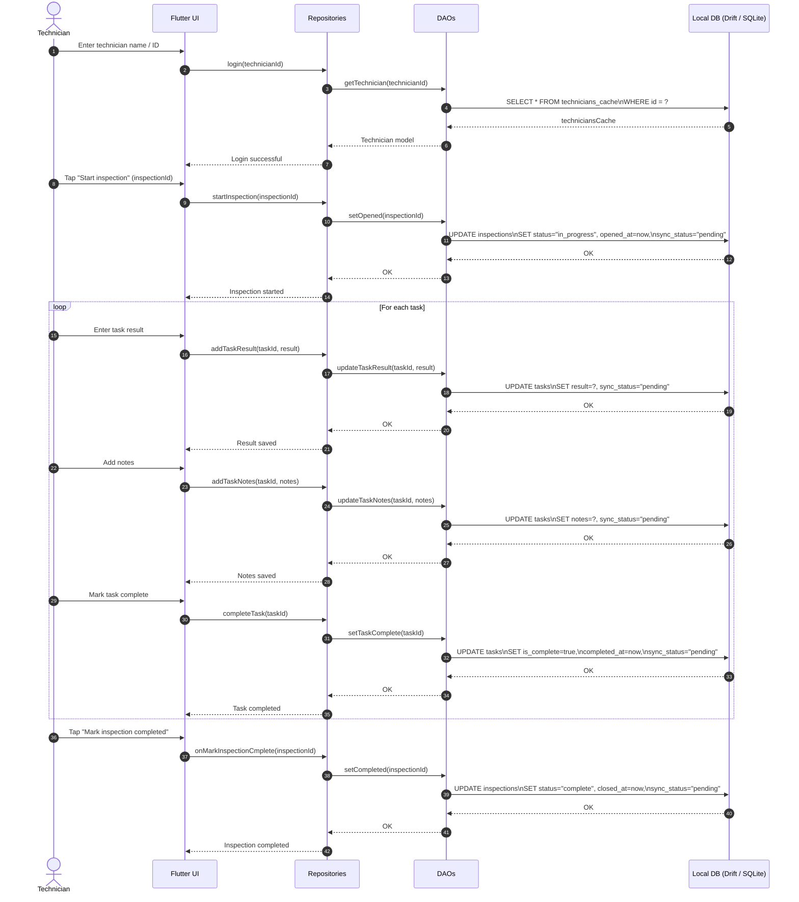

```mermaid
sequenceDiagram
  autonumber

  actor Tech as Technician
  participant UI as Flutter UI
  participant Repos as Repositories
  participant DAOs as DAOs
  participant LDB as Local DB (Drift / SQLite)


  %% Login 
  Tech->>UI: Enter technician name / ID
  UI->>Repos: login(technicianId)
  Repos->>DAOs: getTechnician(technicianId)
  DAOs->>LDB: SELECT * FROM technicians_cache\nWHERE id = ?
  LDB-->>DAOs: techniciansCache
  DAOs-->>Repos: Technician model
  Repos-->>UI: Login successful

  %% Start inspection 
  Tech->>UI: Tap "Start inspection" (inspectionId)
  UI->>Repos: startInspection(inspectionId)
  Repos->>DAOs: setOpened(inspectionId)
  DAOs->>LDB: UPDATE inspections\nSET status="in_progress", opened_at=now,\nsync_status="pending"
  LDB-->>DAOs: OK
  DAOs-->>Repos: OK
  Repos-->>UI: Inspection started

  %% Complete tasks 
  loop For each task
    %% Add task result
    Tech->>UI: Enter task result
    UI->>Repos: addTaskResult(taskId, result)
    Repos->>DAOs: updateTaskResult(taskId, result)
    DAOs->>LDB: UPDATE tasks\nSET result=?, sync_status="pending"
    LDB-->>DAOs: OK
    DAOs-->>Repos: OK
    Repos-->>UI: Result saved

    %% Add task notes
    Tech->>UI: Add notes
    UI->>Repos: addTaskNotes(taskId, notes)
    Repos->>DAOs: updateTaskNotes(taskId, notes)
    DAOs->>LDB: UPDATE tasks\nSET notes=?, sync_status="pending"
    LDB-->>DAOs: OK
    DAOs-->>Repos: OK
    Repos-->>UI: Notes saved

    %% Mark task complete
    Tech->>UI: Mark task complete
    UI->>Repos: completeTask(taskId)
    Repos->>DAOs: setTaskComplete(taskId)
    DAOs->>LDB: UPDATE tasks\nSET is_complete=true,\ncompleted_at=now,\nsync_status="pending"
    LDB-->>DAOs: OK
    DAOs-->>Repos: OK
    Repos-->>UI: Task completed
  end

  %% Finish inspection
  Tech->>UI: Tap "Mark inspection completed"
  UI->>Repos: onMarkInspectionCmplete(inspectionId)
  Repos->>DAOs: setCompleted(inspectionId)
  DAOs->>LDB: UPDATE inspections\nSET status="complete", closed_at=now,\nsync_status="pending"
  LDB-->>DAOs: OK
  DAOs-->>Repos: OK
  Repos-->>UI: Inspection completed
```
