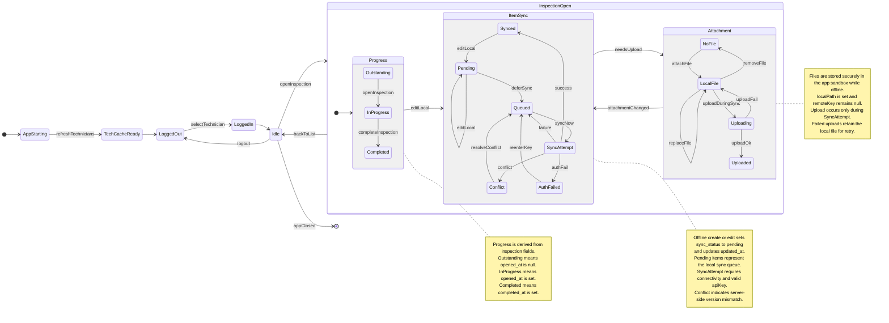

```mermaid
stateDiagram-v2
  direction LR

  [*] --> AppStarting
  AppStarting --> TechCacheReady : refreshTechnicians
  TechCacheReady --> LoggedOut
  LoggedOut --> LoggedIn : selectTechnician
  LoggedIn --> Idle

  Idle --> InspectionOpen : openInspection
  InspectionOpen --> Idle : backToList

  Idle --> LoggedOut : logout
  Idle --> [*] : appClosed

  state InspectionOpen {

    [*] --> Progress

    state Progress {
      Outstanding --> InProgress : openInspection
      InProgress --> Completed : completeInspection
    }

    state ItemSync {
      Synced --> Pending : editLocal
      Pending --> Pending : editLocal
      Pending --> Queued : deferSync
      Queued --> SyncAttempt : syncNow
      SyncAttempt --> Synced : success
      SyncAttempt --> Queued : failure
      SyncAttempt --> Conflict : conflict
      Conflict --> Queued : resolveConflict
      SyncAttempt --> AuthFailed : authFail
      AuthFailed --> Queued : reenterKey
    }

    state Attachment {
      NoFile --> LocalFile : attachFile
      LocalFile --> LocalFile : replaceFile
      LocalFile --> NoFile : removeFile
      LocalFile --> Uploading : uploadDuringSync
      Uploading --> Uploaded : uploadOk
      Uploading --> LocalFile : uploadFail
    }

    %% Logical relationships
    Progress --> ItemSync : editLocal
    Attachment --> ItemSync : attachmentChanged
    ItemSync --> Attachment : needsUpload
  }

  note right of Progress
    Progress is derived from inspection fields.
    Outstanding means opened_at is null.
    InProgress means opened_at is set.
    Completed means completed_at is set.
  end note

  note right of ItemSync
    Offline create or edit sets sync_status to pending
    and updates updated_at.
    Pending items represent the local sync queue.
    SyncAttempt requires connectivity and valid apiKey.
    Conflict indicates server-side version mismatch.
  end note

  note right of Attachment
    Files are stored securely in the app sandbox while offline.
    localPath is set and remoteKey remains null.
    Upload occurs only during SyncAttempt.
    Failed uploads retain the local file for retry.
  end note


```
