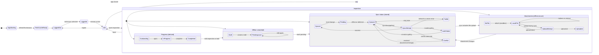

```mermaid
stateDiagram-v2
  direction LR

  [*] --> AppStarting
  AppStarting --> TechCacheReady : refreshTechnicians
  TechCacheReady --> LoggedOut

  LoggedOut --> LoggedIn : technician selected
  LoggedIn --> Idle : session active

  Idle --> Inspection : open inspection
  Inspection --> Idle : back

  Idle --> LoggedOut : logout
  Idle --> [*] : app closed

  state Inspection {
    direction LR

    [*] --> PROG
    [*] --> SYNC
    [*] --> FILES
    [*] --> OFFLINE

    state "Progress (derived)" as PROG {
      direction LR
      Outstanding --> InProgress : open
      InProgress --> Completed : complete
    }

    state "Offline create/edit" as OFFLINE {
      direction LR
      Draft --> PendingLocal : create or edit
      PendingLocal --> PendingLocal : edit again
    }

    state "Sync status (stored)" as SYNC {
      direction LR

      Synced --> Pending : local change
      Pending --> Queued : offline or deferred

      Queued --> SyncAttempt : syncNow(apiKey)
      SyncAttempt --> Synced : success

      SyncAttempt --> Failed : network or server error
      Failed --> Queued : retry later

      SyncAttempt --> AuthFailed : invalid apiKey
      AuthFailed --> Queued : re-enter apiKey

      SyncAttempt --> Conflict : conflict detected
      Conflict --> Queued : resolved (local/server/merge)
    }

    state "Attachments (offline-secure)" as FILES {
      direction LR

      NoFile --> LocalFile : attach (sandbox)
      LocalFile --> LocalFile : replace or remove

      LocalFile --> UploadAttempt : upload during sync
      UploadAttempt --> Uploaded : upload ok
      UploadAttempt --> LocalFile : upload failed
    }

    %% Cross-links (what triggers what)
    PROG --> OFFLINE : edit inspection or task
    OFFLINE --> SYNC : mark pending

    FILES --> SYNC : attachment changed
    SYNC --> FILES : sync includes file upload
  }

```
